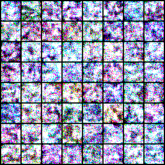
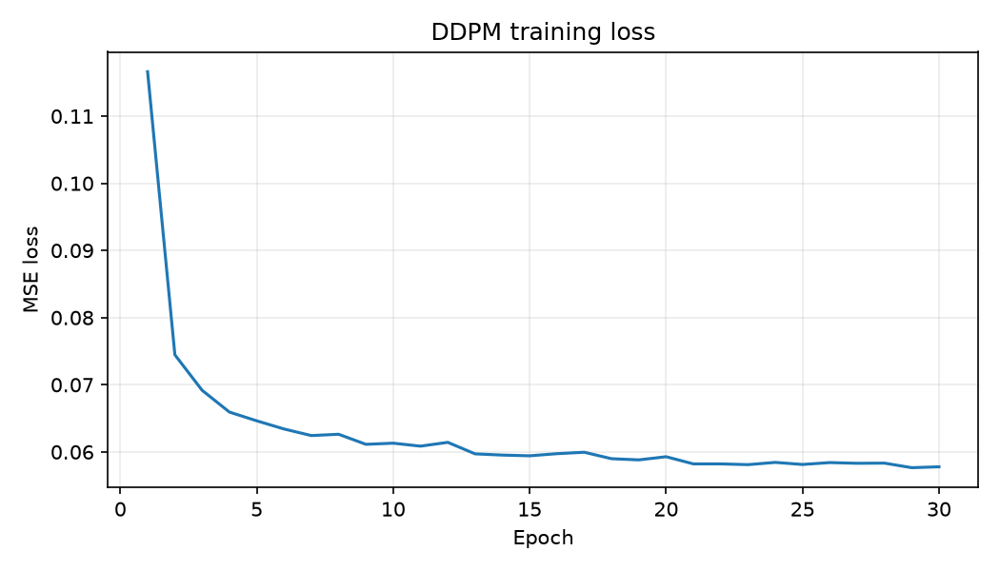
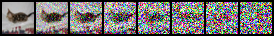

# DDPM from Scratch

[](https://www.python.org/)
[](https://pytorch.org/)
[](LICENSE)

An educational, from-scratch PyTorch implementation of a **Denoising Diffusion Probabilistic Model (DDPM)** for MNIST and CIFAR-10. It contains the Gaussian forward process, a time-conditioned U-Net noise predictor, ancestral reverse sampling, EMA weights, checkpointing, sample grids, noising visualizations, and Fréchet Inception Distance (FID), without a diffusion framework such as `diffusers`.

## Portfolio summary

> This project implements a Denoising Diffusion Probabilistic Model (DDPM) from scratch in PyTorch, training it to generate images on MNIST and CIFAR-10. Unlike using pre-built APIs like Stable Diffusion, this repository demonstrates foundational understanding of score-based generative modeling, stochastic processes, and deep neural network architecture design. It includes a full training pipeline with EMA, checkpointing, FID evaluation, and interactive visualizations.

## What you will produce

Training creates the following untracked artifacts in `outputs/<dataset>/`:

| Artifact | Why it matters | Include on GitHub? |
| --- | --- | --- |
| `samples/epoch_XXX.png` | Visual proof of generated images improving over time | Yes: copy the best 1-3 grids to `results/` |
| `loss.png` | Demonstrates stable optimization | Yes: copy the final chart to `results/` |
| `noising_steps.png` | Shows the forward diffusion process | Yes: copy one image to `results/` |
| `evaluation/samples.png` | Final sample grid from the EMA checkpoint | Yes: copy to `results/` |
| `evaluation/fid.txt` | Reproducible quantitative evaluation | Yes: report its value in the Results table |
| `checkpoints/*.pt` | Allows resume/generation | Usually no; use a release link only if the file is small enough |

Do **not** invent a FID, training time, GPU, or quality claim. The Results section below has explicit placeholders for values measured from your own run.

## Repository layout

```text
configs/       All hyperparameters for MNIST and CIFAR-10
data/          Auto-downloaded datasets (ignored by Git)
models/        U-Net, DDPM equations, and EMA
notebooks/     Interactive walkthrough after training
results/       Small, committed portfolio artifacts and result notes
scripts/       One-line Bash runners
training/      Train and evaluate command-line entry points
utils/         Config loading, visualizations, and FID helpers
```

## End-to-end guide

### 1. Prerequisites

Install the following before you begin:

- Git 2.x.
- Python 3.14 is supported. Use the current 64-bit CPython release and a fresh
  virtual environment for this project.
- NVIDIA GPU and a CUDA-compatible PyTorch build for practical training. MNIST can be used to validate the pipeline; CIFAR-10 is the portfolio run.

Check your installation:

```bash
python --version
git --version
```

If `python` is not found on Windows, install Python from python.org and select **Add Python to PATH**, then open a new terminal. You can alternatively use `py -3.14` in every command below.

### 2. Create and activate an environment

From the repository root:

```bash
python -m venv .venv
```

If you already created `.venv` with an older Python version or had a failed
install, delete that environment and recreate it with Python 3.14. On Windows
PowerShell, run this *only from the repository root*:

```powershell
Deactivate  # Ignore the error if no environment is active.
Remove-Item -Recurse -Force .venv
py -3.14 -m venv .venv
```

Activate it:

```powershell
# Windows PowerShell
.venv\Scripts\Activate.ps1
```

```bash
# macOS or Linux
source .venv/bin/activate
```

Install the Python-3.14-compatible project dependencies. For a CPU-only
machine, use the generic requirements file:

```bash
python -m pip install --upgrade pip
python -m pip install --upgrade --force-reinstall -r requirements.txt
```

### NVIDIA GPU install (Windows / CUDA 13)

If `nvidia-smi` reports an NVIDIA GPU and a CUDA 13-capable driver, use the
GPU-specific requirements file instead. It installs a matching CUDA 13.0 pair
of PyTorch 2.13.0 and torchvision 0.28.0, both with Python 3.14 Windows wheels.
The CUDA toolkit itself does **not** need to be installed separately.

```powershell
python -m pip uninstall -y torch torchvision
python -m pip install --upgrade --force-reinstall -r requirements-cu130.txt
```

Verify that PyTorch sees your GPU (it is fine if this prints `False` for a quick CPU smoke test):

```bash
python -c "import torch, torchvision; print('torch:', torch.__version__); print('torchvision:', torchvision.__version__); print('CUDA:', torch.cuda.is_available()); print('GPU:', torch.cuda.get_device_name(0) if torch.cuda.is_available() else 'not detected')"
```

If CUDA is `False` despite having an NVIDIA GPU, install the PyTorch wheel that matches your CUDA setup using the selector on pytorch.org, then rerun the check.

### 3. Understand the configs before training

All tunable values live in YAML, not source code:

- `configs/mnist.yaml` is the low-cost validation configuration: 1 channel, 32×32 resized inputs, linear schedule, 30 epochs.
- `configs/cifar10.yaml` is the larger portfolio configuration: 3 channels, cosine schedule, wider U-Net, 100 epochs.

Important settings are `batch_size`, `epochs`, `learning_rate`, `timesteps`, `beta_schedule`, `base_channels`, `channel_multipliers`, `sample_every`, and `checkpoint_every`. Change one variable at a time and record changes in your results table.

### 4. Run a MNIST validation experiment

This downloads MNIST automatically into `data/`, normalizes images to `[-1, 1]`, and starts training:

```bash
python -m training.train --config configs/mnist.yaml
```

Equivalent Bash command:

```bash
bash scripts/train_mnist.sh
```

At each configured interval, inspect:

```text
outputs/mnist/loss.png
outputs/mnist/noising_steps.png
outputs/mnist/samples/epoch_XXX.png
outputs/mnist/checkpoints/epoch_XXX.pt
```

Success criteria: loss decreases rather than diverges; early samples are noisy; later samples become recognizable digits; the noising image gets progressively less recognizable.

### 5. Resume safely, if needed

Use the latest checkpoint rather than restarting:

```bash
python -m training.train --config configs/mnist.yaml \
  --resume outputs/mnist/checkpoints/epoch_005.pt
```

On PowerShell, write the command on one line or use the PowerShell continuation character (a backtick), not the Bash backslash.

### 6. Run the CIFAR-10 portfolio experiment

After MNIST works, start CIFAR-10. The dataset also downloads automatically.

```bash
python -m training.train --config configs/cifar10.yaml
```

Before committing to a long run, record the date, Git commit hash, GPU model, batch size, seed, and configuration file. This makes your final results credible and reproducible.

### 7. Generate final samples and calculate FID

Use an EMA checkpoint, which is normally better for sampling than the instantaneous training weights:

```bash
python -m training.evaluate --config configs/cifar10.yaml \
  --checkpoint outputs/cifar10/checkpoints/epoch_100.pt \
  --num-images 10000
```

For a fast MNIST check, use the same command with the MNIST configuration and `--num-images 1000`.

The first FID call downloads pretrained InceptionV3 weights. Results are written to:

```text
outputs/cifar10/evaluation/samples.png
outputs/cifar10/evaluation/fid.txt
```

FID is useful only as a comparison made with the same dataset split, preprocessing, feature extractor, and sample count. Lower is better; do not compare a 1,000-image MNIST number to a published 50,000-image CIFAR-10 number.

### 8. Curate the committed results folder

Keep the repository lightweight. Copy—not move—the small, persuasive artifacts into `results/`:

```powershell
# Windows PowerShell example
Copy-Item outputs\cifar10\evaluation\samples.png results\cifar10_final_samples.png
Copy-Item outputs\cifar10\loss.png results\cifar10_loss.png
Copy-Item outputs\cifar10\noising_steps.png results\cifar10_noising_steps.png
```

Also update [`results/README.md`](results/README.md) with the exact run metadata and FID. Do not commit `data/`, `outputs/`, or large checkpoints unless you intentionally publish a release asset.

### 9. Update the Results section

Replace every bracketed placeholder below after you have trained the model. Add only files that exist in `results/`.

## Results

### Final experiment record

| Field | MNIST | CIFAR-10 |
| --- | --- | --- |
| Configuration | `configs/mnist.yaml` | `configs/cifar10.yaml` |
| Checkpoint evaluated | `epoch_030.pt` | `epoch_030.pt` |
| Training hardware | NVIDIA GeForce GTX 1650 | NVIDIA GeForce GTX 1650 |
| Total training time | ~1 hour | ~3.5 hours |
| Seed | `42` | `42` |
| Evaluation sample count | 1000 | 5000 |
| FID | Not evaluated | 230.49 (5000 images) |

### Generated samples

After copying the images, uncomment and update the captions:

```markdown

*EMA samples from checkpoint `epoch_030.pt`; 650 diffusion steps; seed 42.*


*Mean epsilon-prediction MSE per epoch.*


*A held-out image progressively corrupted by the configured forward process.*

### Interpretation

The loss declined steadily through epoch 30, indicating stable optimization. The EMA samples show recognizable CIFAR-10 class structure with clear color and shape patterns, though fine-grained details remain somewhat blurry. The FID of 230.49 on 5000 images reflects the reduced model capacity (80 base channels, 30 epochs) compared to the original 100-epoch configuration. I would next test increasing epochs to 50-60 while holding the seed and evaluation protocol fixed to improve sample quality.

### 10. Run the notebook

Open `notebooks/demo.ipynb` after a checkpoint exists. Set `checkpoint_path` to a real checkpoint in the notebook, then run all cells. It saves and displays both a forward-noising trajectory and a final EMA sample grid.

### 11. Prepare the GitHub repository

Perform the following from the repository root:

```bash
git init
git add .
git status
git commit -m "Implement DDPM from scratch"
git branch -M main
git remote add origin https://github.com/<your-username>/ddpm-from-scratch.git
git push -u origin main
```

Before `git add .`, read [PUBLISHING_CHECKLIST.md](PUBLISHING_CHECKLIST.md). In particular, confirm `git status` does not list datasets, virtual environments, output directories, API keys, or unintended checkpoints. On GitHub, add repository topics such as `pytorch`, `diffusion-models`, `generative-ai`, `deep-learning`, `ddpm`, and `computer-vision`.

## How the model works

### Forward diffusion

For a clean image `x₀`, Gaussian noise is added according to:

\[
x_t = \sqrt{\bar\alpha_t}x_0 + \sqrt{1-\bar\alpha_t}\epsilon, \quad \epsilon \sim \mathcal{N}(0, I).
\]

`models/diffusion.py` implements this closed-form `q_sample` operation with linear and cosine beta schedules.

### Reverse diffusion and U-Net

The U-Net in `models/unet.py` receives a noisy image and a sinusoidal timestep embedding, then predicts the added noise. It combines residual blocks (GroupNorm, SiLU, convolution), skip connections, and self-attention at lower resolutions. Training minimizes mean-squared error between predicted and actual noise. Sampling begins with Gaussian noise and iterates the learned reverse transition from `T-1` to zero.

### Engineering choices

The training script uses AdamW, gradient clipping, deterministic seeds, periodic checkpoints, and an exponential moving average (EMA) of weights. Sample grids and plots make the process inspectable; the evaluator uses pretrained InceptionV3 features for FID.

## Troubleshooting

| Symptom | Likely cause and action |
| --- | --- |
| Out-of-memory error | Reduce `batch_size` in the config; keep all other settings fixed for that comparison. |
| Training is unexpectedly on CPU | Run the CUDA check in Step 2 and install a GPU-enabled PyTorch wheel. |
| No sample images yet | Wait until `sample_every` epochs have finished, or temporarily lower `sample_every` for a short smoke test. |
| Samples are pure noise | Confirm the correct EMA checkpoint/config pair is used; train longer before judging quality. |
| FID fails before calculation | Verify network access for the one-time InceptionV3 download and that `scipy` is installed. |
| Shell script does not run on Windows | Use the equivalent `python -m training...` command in PowerShell. |

## Reference

Ho, Jain, and Abbeel. *Denoising Diffusion Probabilistic Models.* NeurIPS 2020. [arXiv:2006.11239](https://arxiv.org/abs/2006.11239)

## License

This project is released under the [MIT License](LICENSE).
